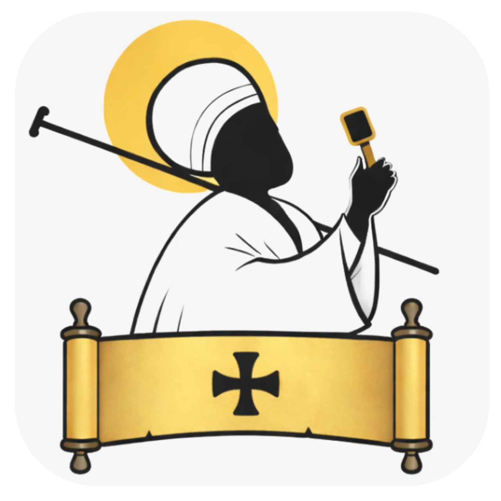
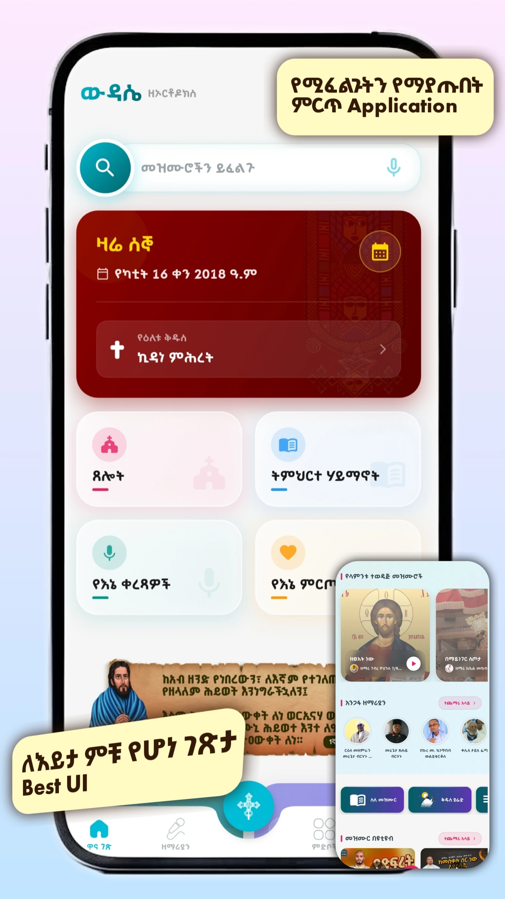
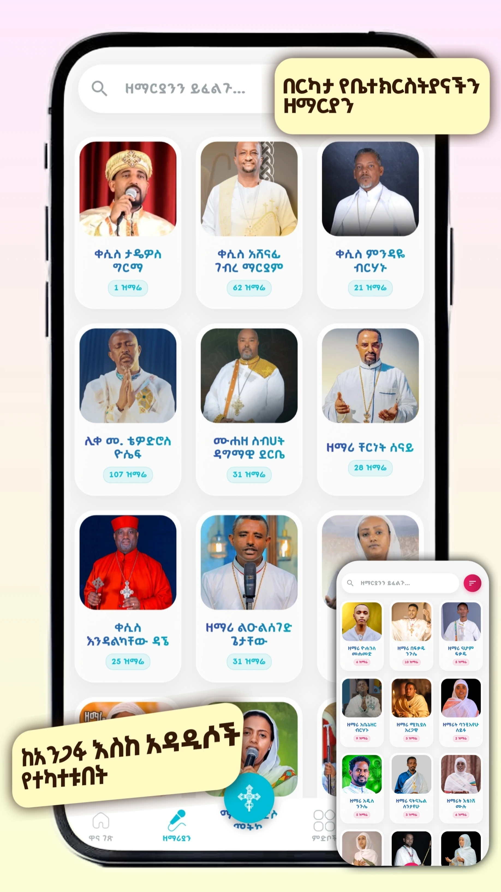
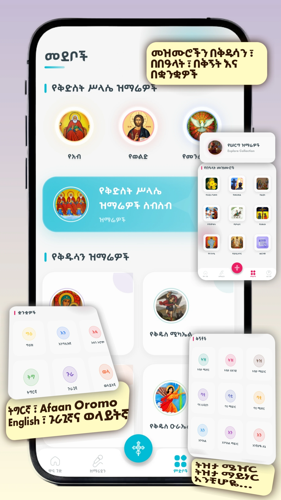
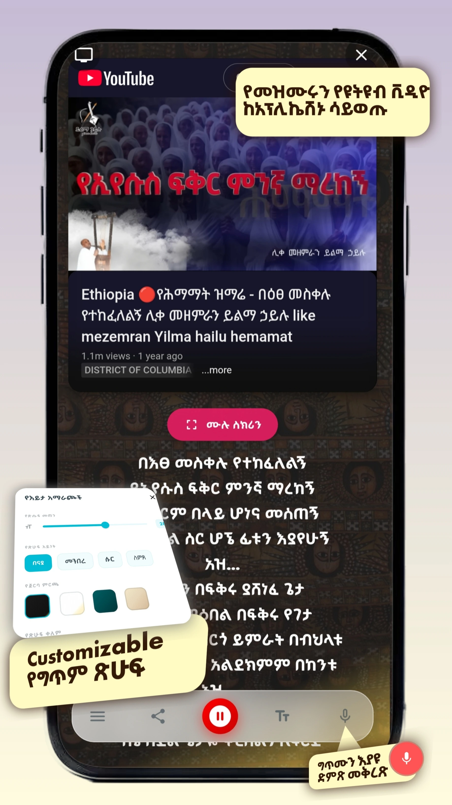
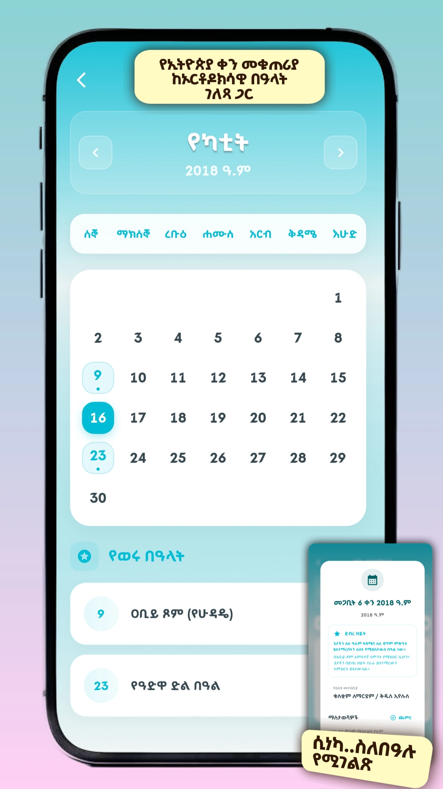
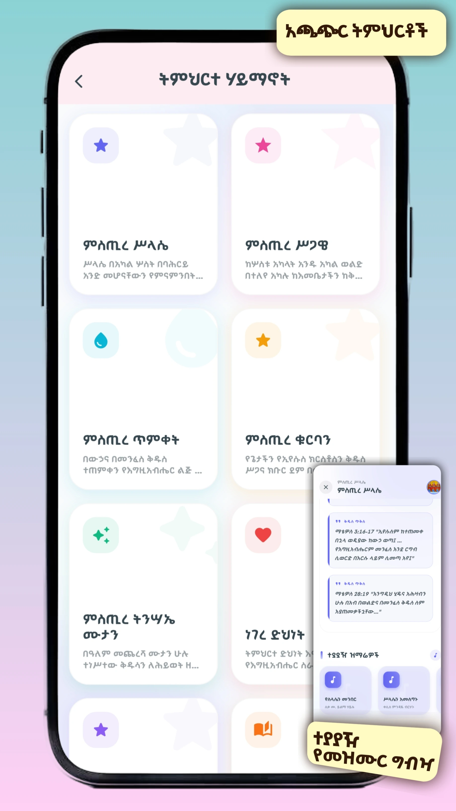
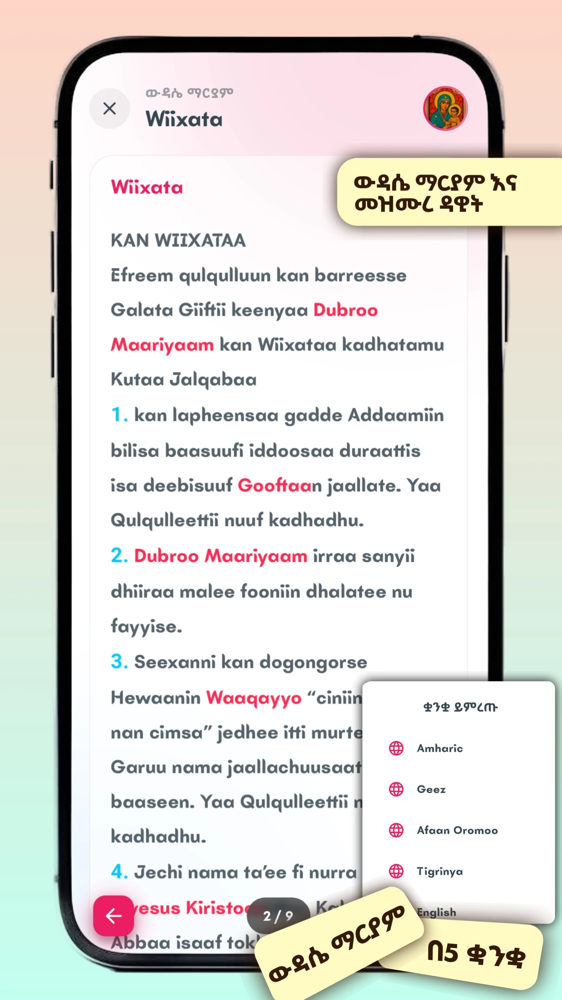

  
  <h1>Wdase Zeorthodox (ውዳሴ ዘ-ኦርቶዶክስ)</h1>
  
<b>A Comprehensive Digital Platform for the Ethiopian Orthodox Tewahedo Church</b>

  

---

## 🌟 Overview | አጠቃላይ መግለጫ

**Wdase Zeorthodox** is a premium digital spiritual companion designed for the faithful of the Ethiopian Orthodox Tewahedo Church. It bridges ancient traditions with modern technology, providing easy access to hymns (Mezmur), daily prayers, and doctrinal education.

**ውዳሴ ዘ-ኦርቶዶክስ** ለኢትዮጵያ ኦርቶዶክስ ተዋሕዶ ቤተክርስቲያን ምዕመናን የተዘጋጀ ሁለንተናዊ ዲጂታል መድረክ ነው። መተግበሪያው የመዝሙር አገልግሎትን፣ ጸሎትን እና መንፈሳዊ ትምህርቶችን በቀላሉ ለምዕመናን ለማድረስ በዘመናዊ አቀራረብ ተዘጋጅቷል።

---

## 📸 Screenshots | ምስሎች

  <table style="border: none;">
    <tr>
     <td></td>
     <td></td>
     <td></td>
     <td></td>
     <td></td>
     <td></td>
     <td></td>
     <td></td>
    </tr>
  </table>

---

## 🚀 Key Features | ዋና ዋና አገልግሎቶች

### 🎵 Hymns & Melody | መዝሙር እና ቅኝት
*   **Extensive Library:** Thousands of hymns with full lyrics categorized by singer and language.
*   **Melody Mode (Kignit):** Specialized support to identify and study hymns via traditional scales (*Tizita, Bati, Ambassel, etc.*).
*   **Voice Recording:** Record your own voice while following the lyrics in real-time.

### 📖 Spiritual Daily Life | መንፈሳዊ ጉዞ
*   **Today’s Summary:** Access the Synaxarion (Saint Histories), Psalms of David, and daily prayers in one view.
*   **Wdase Maryam:** Available in **5 languages** (Geez, Amharic, Afaan Oromo, Tigrigna, and English).
*   **Confession Tools:** A digital assistant to help prepare for the Holy Sacrament of Penance.

### 🛠 Modern Technology | ዘመናዊ አሰራር
*   **Advanced Search:** Integrated Voice Search to find hymns by singer, title, or even specific verses.
*   **YouTube Integration:** Watch official music videos without leaving the application.
*   **Orthodox Calendar:** Dynamic reminders for fasting seasons, feasts, and monthly Saint commemorations.

---

## 🎯 Our Mission | ዓላማችን

Our aim is to enhance the accessibility of Orthodox content in the digital age. We strive to create a convenient platform for singers to lead hymns, Sunday school students to study, and every believer to have the Church's treasures in their pocket.

የቤተክርስቲያንን አገልግሎት በዲጂታሉ ዘርፍ ተደራሽነት ማሳደግ፣ ዘማሪዎች በምቾት መዘመር የሚችሉበትን እና ሰንበት ትምህርት ቤት ተማሪዎችም ግጥሞችን በቀላሉ እንዲያጠኑ ምቹ ሁኔታን መፍጠር ዋነኛ ዓላማችን ነው።

---

## 👨‍💻 The Developers | አዘጋጆቹ

This project is a labor of love and faith, carefully crafted by:

*   **Zemari Solomon Abubeker:** A renowned spiritual singer with over 20 years of gospel ministry.
*   **Eyob Tesfaye:** A specialized software developer and IT professional dedicated to spiritual technology.

---

---

  
<i>እግዚአብሔር ይባርካችሁ! May God bless you!</i>

  
© 2026 Wdase Zeorthodox Project

